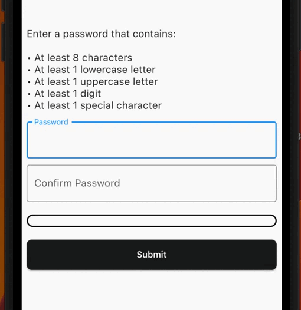
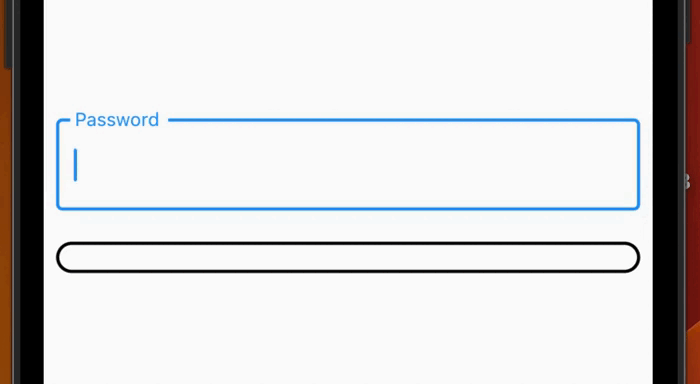
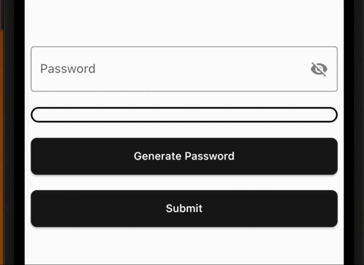

# password_strength_checker
          [](https://github.com/dariowskii/password_strength_checker/actions/workflows/dart.yml)

Generate **secure** passwords, check for exposed passwords, get visual feedback for password strength or get form validation with a minimum password strength required.

Check the strength of the password in a visual way, with an animation when the strength changes according to the settings given by the user.
Use it also inside a `Form` to get form validation!

## Features

- Check for exposed common password using the `commonDictionary`, a map with 10,000 leaked passwords!
- Use the `PasswordStrengthChecker` to have a visual feedback.
- Use the `PasswordStrengthFormChecker` to have a built-in `TextFormField` inside the widget and get form validation using a `minimumStrengthRequired`.
- Use the `PasswordGenerator` class to generate a **secure** random password based on the input configurations (`PasswordGeneratorConfiguration`).
- Create your custom strength to create your own rules or use the `PasswordStrength` default enum (see [Custom Strength](#custom-strength)).

## Demo





## Getting started

### PasswordStrengthChecker

You can use the `PasswordStrengthChecker` to only have a visual feedback, for example:

```dart
final passNotifier = ValueNotifier<PasswordStrength?>(null);
// ...
PasswordStrengthChecker(
  strength: passNotifier,
),
```

See the [full example here](./example/password_strength_checker_example.dart).

### PasswordStrengthFormChecker

You can use the `PasswordStrengthFormChecker` to have a built-in `TextFormField` inside the widget and get form validation using a `minimumStrengthRequired`. For example:

```dart
PasswordStrengthFormChecker(
  minimumStrengthRequired: PasswordStrength.secure,
  onChanged: (password, notifier) {
    notifier.value = PasswordStrength.calculate(text: password);
  },
),
```

See the [full example here](./example/password_strength_form_checker_example.dart).

### PasswordGenerator

You can use the `PasswordGenerator`class to generate a **secure** random password based on the configurations. For example:

```dart
final config = PasswordGeneratorConfiguration(
  length: 32,
  minUppercase: 8,
  minSpecialChars: 8,
  // ...
);

final passwordGenerator = PasswordGenerator.fromConfig(
  configuration: config,
);

final password = passwordGenerator.generate();
```

See the [full example here](./example/password_generator_example.dart).

### Custom Strength

You can use the default `PasswordStrength` enum to set the strength of the password, or you can create your own enum that implements `PasswordStrengthItem` and use it. For example:

```dart
enum CustomPassStrength implements PasswordStrengthItem {
  weak,
  medium,
  strong;

  @override
  Color get statusColor {
    switch (this) {
      case CustomPassStrength.weak:
        return Colors.red;
      case CustomPassStrength.medium:
        return Colors.orange;
      case CustomPassStrength.strong:
        return Colors.green;
    }
  }

  @override
  Widget? get statusWidget {
    switch (this) {
      case CustomPassStrength.weak:
        return const Text('Weak');
      case CustomPassStrength.medium:
        return const Text('Medium');
      case CustomPassStrength.strong:
        return const Text('Strong');
      default:
        return null;
    }
  }

  @override
  double get widthPerc {
    switch (this) {
      case CustomPassStrength.weak:
        return 0.15;
      case CustomPassStrength.medium:
        return 0.4;
      case CustomPassStrength.strong:
        return 0.75;
      default:
        return 0.0;
    }
  }

  static CustomPassStrength? calculate({required String text}) {
    // Implement your custom logic here
    if (text.isEmpty) {
      return null;
    }
    // Use the [commonDictionary] to see if a password
    // is in 10,000 common exposed password list.
    if (commonDictionary[text] == true) {
      return CustomPassStrength.weak;
    }
    if (text.length < 6) {
      return CustomPassStrength.weak;
    } else if (text.length < 10) {
      return CustomPassStrength.medium;
    } else {
      return CustomPassStrength.strong;
    }
  }
}
```

## Contribution

The project is open source and you can contribute to it here -> [repository link](https://github.com/dariowskii/password_strength_checker)

- If you **found a bug**, open an issue.
- If you **have a feature request**, open an issue.
- If you **want to contribute**, submit a pull request.

## Contributors

<a href="https://github.com/dariowskii/password_strength_checker/graphs/contributors">
  
</a>

---

Made with ❤️ from [dariowskii](https://www.linkedin.com/in/dario-varriale/)
